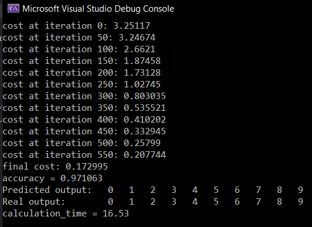

# MLP
multi-layer perceptron implementation in C++
This code allows for training a fully-connected neural network for classification with arbitrary size and 
number of layers. It uses OpenMP to speed up code execution. All the info and weights for each layer are 
stored in a struct called `Layer` and the info and gradients for backpropagation of each layer are stored 
in a struct called `Grad`. A new Layer and a Grad are added to DeepModel object once a layer is added to 
the model. To use the code follow the below rules:

## Data Entry 
Input data is stored in a CSV file. `LoadData` function reads this file and stores data to `X_train` and `Y_train`.
The current implementation of the code uses the entire dataset for training. You can split data to two training 
and test sets by yourself.
## Data Normalization
Normalize function normalizes data to [0, 1] range. It is not mandatory to use this function.
## Instantiating a DeepModel object
Define a DeepModel object. The object can be defined on either stack or heap. In either cases, the memory required
for `Layer` and `Grad` will be dynamically allocated on heap.
## Adding A Fully Connected Layer
Use `AddLayer("Dense", num_hidden, "activation")` to add a dense layer. `num_hidden` is a positive integer number.
You can add as many layers as you want.
## Activation Functions
The model accepts for activations: "none", "sigmoid", "relu" and "softmax". "softmax" is only allowed for the
last layer while "none" is not allowed for the last layer activation.
## Setting Up The Optimizer
Use `SetOptimizer("GradientDescent", learning_rate, decay)` to set up the optimizer. "GradientDescent" is the
only available optimizer at this time.
## Training The Model
Use `Train(X_train, Y_train, num_iteration, "objective_function")` to train the model. "objective_function"
could be either "cross_entropy" or "mean_square".
## Validating The Model
`Validate(X_train, Y_train, num_sample)` evaluates the accuracy of the trained model for the first num_sample
training samples. The function returns the accuracy score.
## Testing 
`Classify(X_test, Y_pred, num_test)` can be used to classify the input `X_test`. `Y_pred` is a dinamically allocated 
array with size num_test which returns the classification results. 

Training and test results using MNIST data set after 600 iterations.
